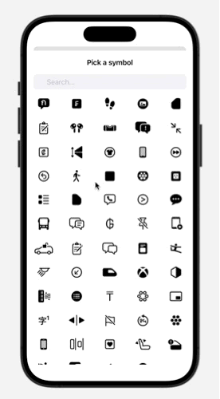

# SF Symbols Picker

SFSymbolsPicker is a simple and powerful SwiftUI picker that let you pick Apple's SF Symbols inside your iOS app with an easy binding!


### 1.0.2 (October 2023)

**New update**: the way the package loads SF symbols has radically changed. Now the symbols are read at run-time directly by the system, so the users can access the latest symbols added by Apple as soon as they update their devices.

Special thanks to [mackoj](https://github.com/mackoj) for the suggestion in implementing this solution.

## Example

Here's a short usage example. You can find the full code in [UsageExample.swift](https://github.com/alessiorubicini/SFSymbolsPickerForSwiftUI/blob/master/Sources/SFSymbolsPicker/UsageExample.swift).

```swift
@State private var icon = "l1.rectangle.roundedbottom"
@State private var isPresented = false

var body: some View {
    NavigationView {
        VStack {
            Button("Select a symbol") {
                isPresented.toggle()
            }

            Image(systemName: icon).font(.title3)

            .sheet(isPresented: $isPresented, content: {
                SymbolsPicker(selection: $icon)
            })

            .padding()

        }
    .navigationTitle("SF Symbols Picker")
    }
}
```



## Installation

Required:
- iOS 14.0 or above
- Xcode 12.0 or above

In Xcode go to `File -> Swift Packages -> Add Package Dependency` and paste in the repo's url: `https://github.com/alessiorubicini/SFSymbolsPicker`.
Then choose the main branch (versions support coming soon).

## License

Copyright 2023 (©) Alessio Rubicini.

The license for this repository is MIT License.

Please see the [LICENSE](LICENSE) file for full reference
