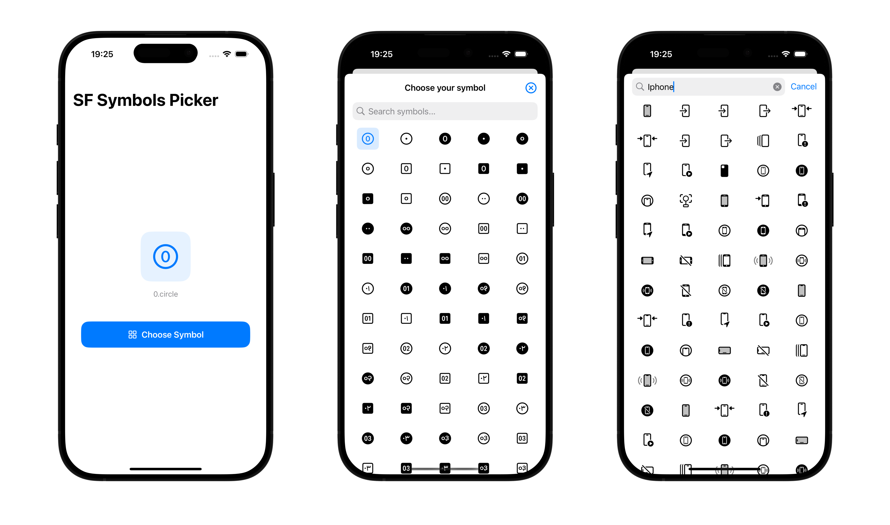

<div align="center">
  
  <h1><b>SF Symbols Picker for SwiftUI</b></h1>
  <p>
    SFSymbolsPicker is a simple and powerful SwiftUI picker that let you pick Apple's SF Symbols inside your iOS and macOS apps with an easy binding!
    <br>
  </p>
</div>

<div align="center">
  <a href="https://swift.org">
<!--      -->
    
  </a>
  <a href="https://www.apple.com/ios/">
    
  </a>
  <a href="LICENSE">
    
  </a>
</div>

## Features

- **Easy Integration**: Simple SwiftUI binding for seamless symbol selection
- **Cross-Platform**: Full support for both iOS and macOS applications
- **Dynamic Symbol Access**: Always up-to-date with the latest SF Symbols from the system
- **Customizable Interface**: 
  - Custom title and search bar label
  - Optional custom close button
  - Configurable auto-dismiss behavior
- **Intuitive Search**: Powerful search functionality to quickly find the perfect symbol
- **System Integration**: Native toolbar icon support for easy dismissal
- **Modern Design**: Clean and consistent with Apple's design language
- **Performance Optimized**: Efficient symbol loading and rendering

## Preview


## Usage

Here's a short usage example. You can find the full code in [UsageExample.swift](https://github.com/alessiorubicini/SFSymbolsPickerForSwiftUI/blob/master/Sources/SFSymbolsPicker/UsageExample.swift).

```swift
@State private var icon = "star.fill"
@State private var isPresented = false
    
var body: some View {
    NavigationView {
        VStack {
            Button("Select a symbol") {
                isPresented.toggle()
            }

            Image(systemName: icon).font(.title3)

                .sheet(isPresented: $isPresented, content: {
                    SymbolsPicker(selection: $icon, title: "Pick a symbol", autoDismiss: true)
                }).padding()

        }
        .navigationTitle("SF Symbols Picker")
    }
}
```

With custom button:

```swift
...

    .sheet(isPresented: $isPresented, content: {
        SymbolsPicker(selection: $icon, title: "Pick a symbol", autoDismiss: true) {
            // Your custom view...
            // For example:
            Text("Close!")
        }
    }).padding()
...
```


## Installation

Required:
- iOS 17.0 or above
- macOS 14.0 or above
- Xcode 15.0 or above

In Xcode go to `File -> Add Package Dependencies...` and paste in the repo's url: `https://github.com/alessiorubicini/SFSymbolsPicker`.
Then choose the main branch or the version you desire.

## License

Copyright 2025 (©) Alessio Rubicini.

The license for this repository is MIT License.

Please see the [LICENSE](LICENSE) file for full reference
