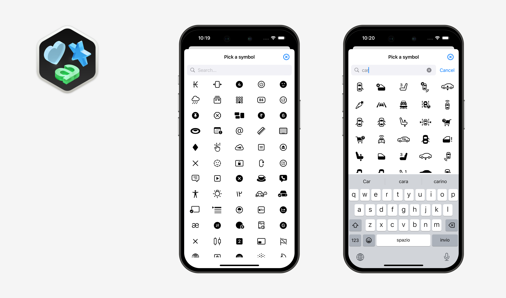

<div align="center">
  
  <h1><b>SF Symbols Picker for SwiftUI</b></h1>
  <p>
    SFSymbolsPicker is a simple and powerful SwiftUI picker that let you pick Apple's SF Symbols inside your iOS and macOS apps with an easy binding!
    <br>
  </p>
</div>

<div align="center">
  <a href="https://swift.org">
<!--      -->
    
  </a>
  <a href="https://www.apple.com/ios/">
    
  </a>
  <a href="LICENSE">
    
  </a>
</div>

## Features

- **Custom Close Button**: Specify a custom close button for the picker.
- **macOS Support**: Compatible with macOS 11.0 and above.
- **Optimized Performance**: Improved symbol loading performance for a smoother experience.
- **Enhanced Search Bar**: Upgraded search bar for better usability.
- **Bug Fixes**: Resolved visibility issues for the SymbolPicker view.
- **Auto Dismiss**: Automatically dismiss the picker when a symbol is selected.
- **Customizable UI**: Set a custom title for the view and a label for the search bar.
- **Toolbar Icon**: Added a toolbar icon to manually dismiss the picker.
- **Dynamic Symbol Loading**: Symbols are loaded at runtime directly from the system, ensuring access to the latest symbols as soon as devices are updated. Special thanks to [mackoj](https://github.com/mackoj) for contributing to the dynamic symbol loading implementation.

## Preview


## Usage

Here's a short usage example. You can find the full code in [UsageExample.swift](https://github.com/alessiorubicini/SFSymbolsPickerForSwiftUI/blob/master/Sources/SFSymbolsPicker/UsageExample.swift).

```swift
@State private var icon = "star.fill"
@State private var isPresented = false
    
var body: some View {
    NavigationView {
        VStack {
            Button("Select a symbol") {
                isPresented.toggle()
            }

            Image(systemName: icon).font(.title3)

                .sheet(isPresented: $isPresented, content: {
                    SymbolsPicker(selection: $icon, title: "Pick a symbol", autoDismiss: true)
                }).padding()

        }
        .navigationTitle("SF Symbols Picker")
    }
}
```

With custom button:

```swift
...

    .sheet(isPresented: $isPresented, content: {
        SymbolsPicker(selection: $icon, title: "Pick a symbol", autoDismiss: true) {
            // Your custom view...
            // For example:
            Text("Close!")
        }
    }).padding()
...
```


## Installation

Required:
- iOS 15.0 or above
- macOS 12.0 or above
- Xcode 13.0 or above

In Xcode go to `File -> Add Package Dependencies...` and paste in the repo's url: `https://github.com/alessiorubicini/SFSymbolsPicker`.
Then choose the main branch or the version you desire.

## License

Copyright 2024 (©) Alessio Rubicini.

The license for this repository is MIT License.

Please see the [LICENSE](LICENSE) file for full reference
