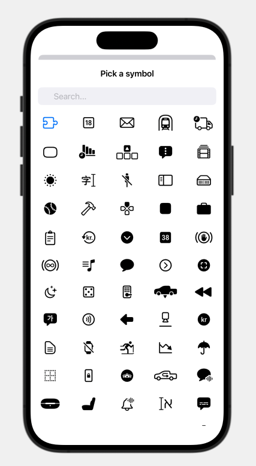

# SFSymbolsPicker

SFSymbolsPicker is a simple and powerful SwiftUI picker that let you pick Apple's SFSymbols inside your iOS app with an easy binding!



## Example

```swift
@State private var icon = "l1.rectangle.roundedbottom"

@State private var isPresented = false

var body: some View {
    Form {        
        Button(action: {
            withAnimation {
                isPresented.toggle()
            }
        }, label: {
            HStack {
                Text("Press Here")
                Spacer()
                Image(systemName: icon)
            }
        })
        
        SFSymbolsPicker(isPresented: $isPresented, icon: $icon, category: .games, axis: .vertical, haptic: true)
    }
}
```

## Installation

Required:
- iOS 14.0 or above
- Xcode 12.0 or above

In Xcode go to `File -> Swift Packages -> Add Package Dependency` and paste in the repo's url: `https://github.com/alessiorubicini/SFSymbolsPicker`.
Then choose the main branch (versions support coming soon).
