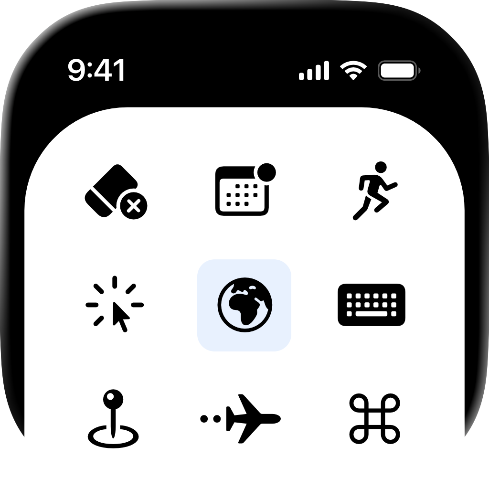
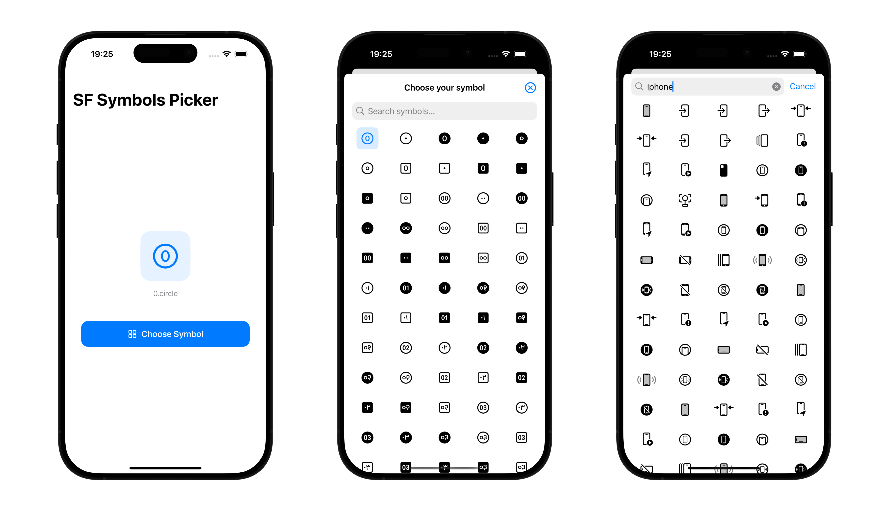

<div align="center">
  
  <h1>SF Symbols Picker for SwiftUI</h1>
  <p>A simple, highly customizable SwiftUI component for picking Apple's SF Symbols in iOS and macOS applications.</p>

  <p>
    <a href="https://swift.org">
      
    </a>
    <a href="https://www.apple.com/ios/">
      
    </a>
    <a href="https://www.apple.com/macos/">
      
    </a>
    <a href="LICENSE">
      
    </a>
  </p>
</div>

---

## Features

- **Cross-Platform Support**: Built natively for both iOS and macOS applications.
- **Dynamic & Safe Loading**: Integrates with `SFSafeSymbols` for type-safe compile-time checks and performance-optimized rendering.
- **Customizable UI**:
  - Custom title and search placeholder text.
  - Optional custom close button views.
  - Interactive search bar with native behaviors.
- **Auto-Dismiss Option**: Close the picker sheet automatically upon selecting a symbol.
- **Custom Symbol Subsets**: Restrict the list to display only specific symbols.
- **Localization support**: Fully supports custom string keys and localizations.

## Preview



## Installation

### Swift Package Manager (SPM)

1. In Xcode, select **File** > **Add Package Dependencies...**
2. Enter the repository URL: `https://github.com/alessiorubicini/SFSymbolsPickerForSwiftUI`
3. Set the dependency rule to the desired version or branch.

## Requirements

- **iOS**: 17.0+
- **macOS**: 14.0+
- **Xcode**: 15.0+
- **Swift**: 5.9+

## Usage

### 1. Basic Usage

Present the `SymbolsPicker` in a sheet with a simple binding to a `String` variable.

```swift
import SwiftUI
import SFSymbolsPicker

struct BasicExampleView: View {
    @State private var selectedSymbol = "star.fill"
    @State private var isPickerPresented = false
    
    var body: some View {
        NavigationStack {
            VStack(spacing: 20) {
                Image(systemName: selectedSymbol)
                    .font(.largeTitle)
                
                Button("Select Symbol") {
                    isPickerPresented.toggle()
                }
            }
            .sheet(isPresented: $isPickerPresented) {
                SymbolsPicker(
                    selection: $selectedSymbol,
                    title: "Select a Symbol",
                    autoDismiss: true
                )
            }
        }
    }
}
```

### 2. Custom Symbol Subset

Limit the symbols available for selection by passing an array of `SFSymbol` objects from the `SFSafeSymbols` package. See [CustomSymbolsExample.swift](Sources/SFSymbolsPicker/Examples/CustomSymbolsExample.swift) for a full example.

```swift
import SwiftUI
import SFSymbolsPicker
import SFSafeSymbols

struct CustomSubsetView: View {
    @State private var selectedSymbol = "figure.walk"
    @State private var isPickerPresented = false
    
    var body: some View {
        Button("Choose Movement Symbol") {
            isPickerPresented.toggle()
        }
        .sheet(isPresented: $isPickerPresented) {
            SymbolsPicker(
                selection: $selectedSymbol,
                title: "Movement Symbols",
                searchLabel: "Search...",
                autoDismiss: true,
                symbols: [
                    .figureWalk,
                    .figureWalkCircle,
                    .figureWalkCircleFill,
                    .figureWave,
                    .figureWaveCircle,
                    .figureWaveCircleFill
                ]
            )
        }
    }
}
```

### 3. Custom Close Button

Customize the appearance of the close button by providing a `@ViewBuilder` trailing closure.

```swift
SymbolsPicker(
    selection: $selectedSymbol,
    title: "Choose Symbol",
    autoDismiss: true
) {
    Image(systemName: "xmark.circle")
        .foregroundColor(.red)
}
```

For more examples, refer to:
- [AllSymbolsExample.swift](Sources/SFSymbolsPicker/Examples/AllSymbolsExample.swift)
- [CustomSymbolsExample.swift](Sources/SFSymbolsPicker/Examples/CustomSymbolsExample.swift)

## License

This package is released under the MIT License. See [LICENSE](LICENSE) for more details.
